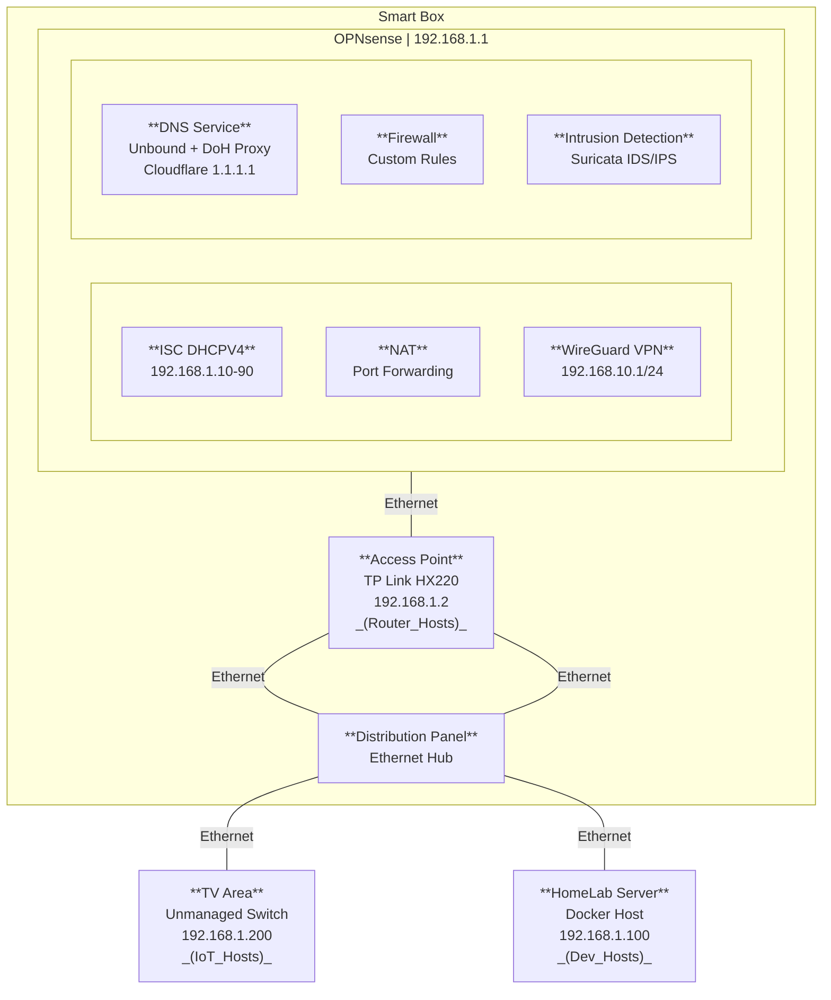

# Network Configuration

The network is the powerhouse of the cell! (_or was that the mitochandria?_) Close enought for y'all to get the message anyway.

## 1. Basic Network Map

## 2. Network Services

### 2.1 [DNS Configuration](https://docs.opnsense.org/manual/unbound.html)

- **Service**: [Unbound DNS](https://nlnetlabs.nl/projects/unbound/about/) with DoH proxy
- **Upstream**: [Cloudflare 1.1.1.1](https://developers.cloudflare.com/1.1.1.1/) public DNS
- **Encryption**: DNS over HTTPS for privacy protection
- **Features**: Local caching, ad blocking, custom overrides

### 2.2 [VPN Access](https://docs.opnsense.org/manual/how-tos/wireguard-client.html)

- **Protocol**: [WireGuard VPN](https://www.wireguard.com/) on 192.168.10.1/24
- **Purpose**: Secure remote access to internal network resources
- **Clients**: Mobile devices and remote workstations
- **Security**: Modern cryptography with minimal configuration overhead

### 2.3 [Security & Monitoring](https://docs.opnsense.org/manual/ips.html)

- **IDS/IPS**: [Suricata](https://suricata.io/) for real-time threat detection
- **Rules**: [Emerging Threats](https://rules.emergingthreats.net/) and custom signatures
- **Firewall**: Custom rules with logging and geo-blocking
- **Actions**: Automatic blocking and alerting for threats

## 3. Network Organization

### 3.1 IP Address Allocation

| Range | Purpose | Alias Label |
|-------|---------|-------------|
| 192.168.1.1-9 | Network infrastructure | **Router_Hosts** |
| 192.168.1.10-99 | DHCP dynamic pool | **DHCP_Hosts** |
| 192.168.1.100-199 | Servers and development | **Dev_Hosts** |
| 192.168.1.200-239 | IoT and smart devices | **IoT_Hosts** |
| 192.168.1.227-228 | Nintendo Switch consoles | **NX_Hosts** |
| 192.168.1.230-231 | PlayStation consoles | **PS_Hosts** |
| 192.168.1.240-254 | Isolated/quarantine | **Isolate_Hosts** |

### 3.2 Physical Layout

- **Smart Box**: Houses router, access point, and distribution panel
- **Ethernet Distribution**: Wired connections to TV area and server
- **Wireless Coverage**: TP-Link access point for mobile devices
- **Segmentation**: Network isolation for security and performance
